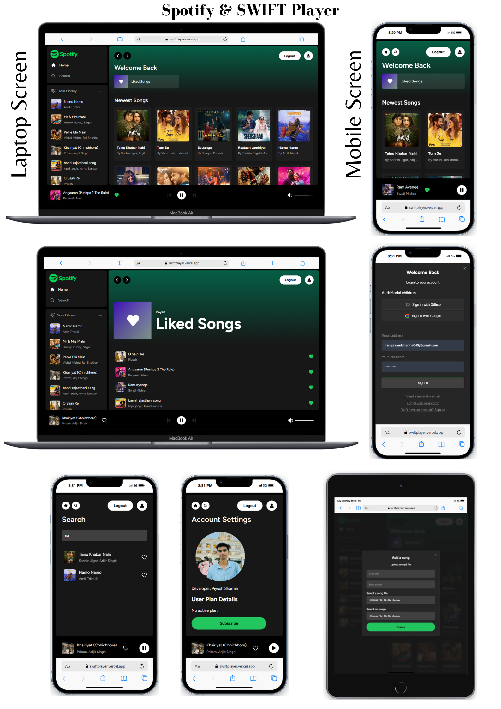

# Full Stack Spotify Clone with Next.js 13.4 App Router: React, Tailwind, Supabase, PostgreSQL, Stripe

This is a repository for a Full Stack Spotify Clone with Next.js 13.4 App Router: React, Tailwind, Supabase, PostgreSQL.
## Project live deploy url = https://swiftplayer.vercel.app/

## Key Features:

- Song upload
- Tailwind design for sleek UI
- Tailwind animations and transition effects
- Full responsiveness for all devices
- Credential authentication with Supabase
- Github authentication integration
- Google authentication integration
- File and image upload using Supabase storage
- Client form validation and handling using react-hook-form
- Server error handling with react-toast
- Play song audio
- Favorites system
- Playlists / Liked songs system
- Advanced Player component
- Stripe recurring payment integration
- How to write POST, GET, and DELETE routes in route handlers (app/api)
- How to fetch data in server React components by directly accessing the database (WITHOUT API! like Magic!)
- Handling relations between Server and Child components in a real-time environment

  ## use Platform & Tools

  - Supabase is an open source Firebase alternative Start your project with a Postgres database, Authentication, instant APIs, Edge Functions, Realtime subscriptions, Storage, and Vector embeddings.
  - Supabase https://supabase.com/
  - Tailwind Ui https://tailwindcss.com/
  - My Project https://swiftplayer.vercel.app/

